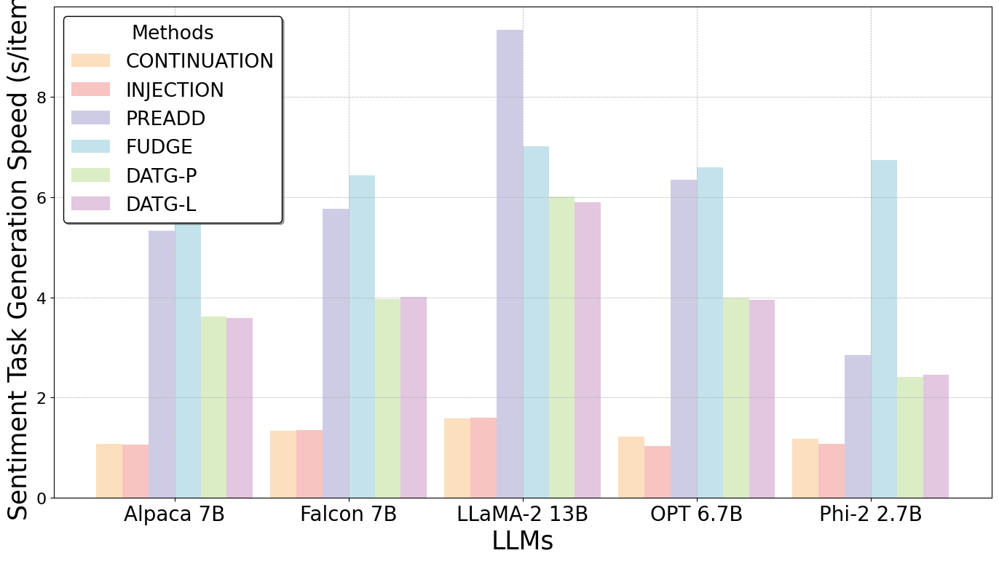

<h1 align="center">
    🕸️ DATG: Controlled Text Generation for Large Language Models with Dynamic Attribute Graphs
</h1>
<p align="center">
A framework designed for controlled text generation in Large Language Models using dynamic attribute graphs.<br>
Refer to our <a href="https://arxiv.org/abs/2402.11218"><b>arXiv paper</b></a> for detailed insights and methodology.
</p>
<p align="center">
    <a href="https://opensource.org/licenses/Apache-2.0">
        
    </a>
    <a href="https://arxiv.org/abs/2402.11218">
        
    </a>
</p>


## Introduction

DATG (Dynamic Attribute Graphs-based Text Generation) is an innovative approach designed for controlled text generation, enabling precise control over text attributes during the decoding phase while maintaining the natural fluency of the text. This method leverages dynamic attribute graphs to evaluate and adjust key terms related to target attributes, thereby controlling the attributes of the generated text effectively without compromising text quality.


## Project structure

```bash
.
├── .cache           # Cache some results during evaluation to prevent losing all results
├── .gitattributes   # Git attributes
├── .gitignore       # Ignore files for git
├── README.md        # Project Description
├── analyst.py       # Generate the statistics
├── config.py        # Configuration file for experiment
├── data             # Data for experiment, training classifier and evaluation
├── main.py          # Core file for running the experiment
├── method           # Different CTG methods (including ours)
├── requirements.txt # Required packages
├── results          # Results of the experiment
├── stats            # Statistics of the experiment generated by analyst.py using the results
├── train            # Scripts for training classifiers and other models
└── utils            # Utilities for the project
```


## Usage

### Setup
- Install Python 3.8.18.

- Clone the project repository.

- Install required dependencies:

- `pip install -r requirements.txt`

- Complete Configuration in `config.py`

  Before initiating experiments, configure `config.py` to suit your experimental setup:

  - **Model Paths**: Specify the locations of your Large Language Models (LLMs) in `MODEL_PATHS`. Ensure these paths are accurate to enable proper model loading.

  - **Classifier Configuration**: Assign paths for internal classifiers (used during generation) and external classifiers (used for evaluation) within `TASK_CONFIGURATIONS`. Utilize the Jupyter notebooks in the `train` directory for training these classifiers, and update their paths accordingly.

  - **Data and Tasks**: Define your specific datasets and tasks in `TASK_CONFIGURATIONS`, including dataset paths and task-specific settings.

  - **Perspective API**: If required, insert your Perspective API keys into `GOOGLE_API_KEYs` after obtaining them. Confirm your system's connectivity to https://commentanalyzer.googleapis.com for accessing API services.

  Ensure all paths, APIs, and configurations are set correctly before running your experiments.

### Running Experiments
1. To run an experiment, use the following command:
   ```bash
   python main.py --model_name <MODEL_NAME> --task_name <TASK_NAME>
   ```
   Replace `<MODEL_NAME>` with one of the available model names: [`phi2_3B_Base`, `llama2_13B_Base`, `falcon_7B_Base`, `opt_7B_Base`, `alpaca_7B_Base`] , or more models you set in the `config.py`.
   
   Replace `<TASK_NAME>` with one of the available task names: [`toxicMitigation`, `2Positive`, `2Negative`], or more tasks you set in the `config.py`.

   Example:
   ```bash
   python main.py --model_name phi2_3B_Base --task_name toxicMitigation
   ```

### Generating Statistics
1. After running experiments, you can generate statistics by executing:
   ```bash
   python analyst.py
   ```
   This will analyze the results and generate statistical data based on the output from the experiments.

## HuggingFace models used in our research

* tatsu-lab/alpaca-7b-wdiff  # Remember to convert the model to HF format and name it alpaca-7b-hf
* tiiuae/falcon-7b
* meta-llama/Llama-2-13b-hf
* facebook/opt-6.7b
* microsoft/phi-2
* BAAI/bge-large-en-v1.5
* openai-community/gpt2-large
* FacebookAI/roberta-base

## Results for Experiment-20240212

<p align="center">
  
  
</p>

<p align="center"></p>

- **Effectiveness and Fluency**: The DATG approach ranks highly in both toxicity mitigation and sentiment transformation tasks, effectively reducing unwanted attributes while maintaining text fluency. This demonstrates the method's ability to produce high-quality, coherent text across different contexts and requirements.
- **Attribute Control Validation**: The success across various datasets confirms our hypothesis that adjusting a few key attribute words can effectively control the text's overall sentiment or toxicity. This strategic modification ensures that the changes in attributes do not compromise the natural flow and coherence of the generated text.
- **Consistency Across Models**: The DATG method shows consistent performance in reducing toxicity and transforming sentiment across different LLMs and datasets. This stability across various conditions underscores the robustness of our approach, highlighting its adaptability to different LLMs without losing quality.

<p align="center">
  
  
</p>

- **Speed Advantage**: DATG exhibits faster generation speeds compared to PREADD and FUDGE, emphasizing the efficiency of our approach even when integrating complex attribute control mechanisms.
- **Potential for Speed Improvement**:Further enhancement in generation speed could be achieved by pre-generating extensive attribute graphs, allowing for faster identification of relevant sub-graphs and nodes during generation.

## Citation

```BibTeX
@inproceedings{liang-etal-2024-controlled,
    title = "Controlled Text Generation for Large Language Model with Dynamic Attribute Graphs",
    author = "Liang, Xun and Wang, Hanyu and Song, Shichao and Hu, Mengting and Wang, Xunzhi and Li, Zhiyu and Xiong, Feiyu and Tang, Bo",
    editor = "Ku, Lun-Wei and Martins, Andre and Srikumar, Vivek",
    booktitle = "Findings of the Association for Computational Linguistics ACL 2024",
    month = aug,
    year = "2024",
    address = "Bangkok, Thailand and virtual meeting",
    publisher = "Association for Computational Linguistics",
    url = "https://aclanthology.org/2024.findings-acl.345",
    doi = "10.18653/v1/2024.findings-acl.345",
    pages = "5797--5814",
}
```
